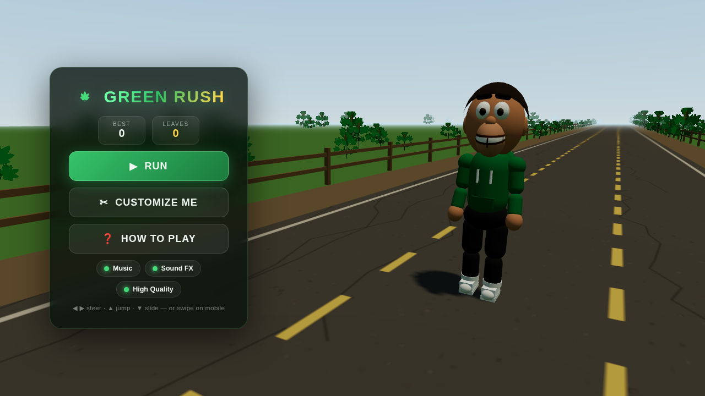
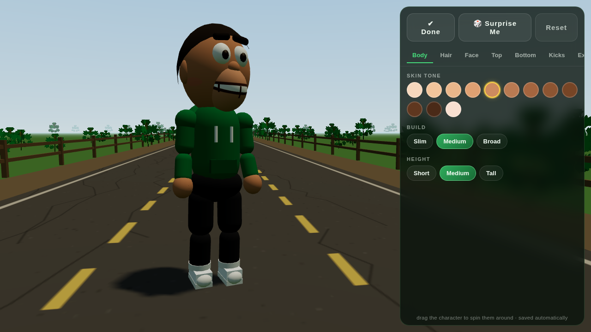
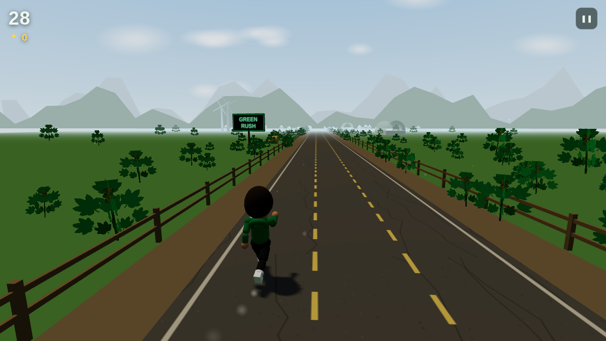
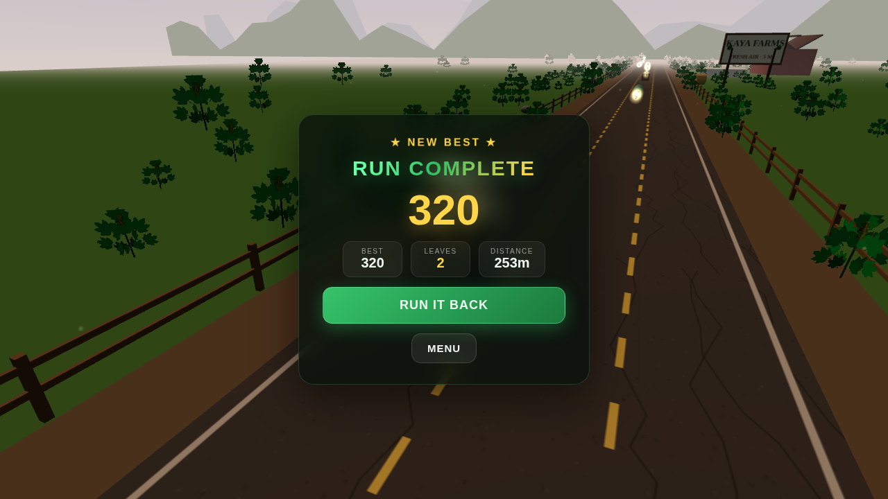

# 🍃 Green Rush

**A chill, cannabis-country endless runner** — Temple Run vibes, claymation-style
characters (think British stop-motion: googly eyes, huge molded grins, plasticine
fingerprints), and a fully procedural world. Built with three.js, zero build step,
zero external assets: every texture, character, sound, and song is generated in code
at runtime.

> 21+ vibes · enjoy responsibly · no plants were harmed

| | |
|---|---|
|  |  |
|  |  |

## ▶ How to play

The game is a plain static site — no install, no build.

**Option A — just open it:**
double-click `index.html`. Everything (including three.js) loads from local files.

**Option B — serve it (recommended):**

```bash
cd kanya-nail-spa
python3 -m http.server 8000
# then open http://localhost:8000
```

**Option C — GitHub Pages:** enable Pages on this branch and play it from the URL.
Works great on phones — controls switch to swipe gestures automatically.

### Controls

| Action | Keyboard | Touch |
|---|---|---|
| Change lane | ◀ ▶ or A / D | swipe left / right |
| Jump | ▲, W or Space | swipe up |
| Slide | ▼ or S | swipe down |
| Pause | P or Esc | ❚❚ button |

## 🎓 First run = guided tutorial

Your first RUN walks you through everything at a gentle pace — steering, jumping the
crate, sliding under the pipe, grabbing leaves — with no way to lose. Skippable, and
replayable any time from **HOW TO PLAY** in the menu.

## ✂ Customize your runner (claymation-style)

Hit **CUSTOMIZE ME** and drag the character to spin them around. Characters are
built like stop-motion puppets — big close-set googly 3D eyes, thick clay brow slugs,
a protruding muzzle with an enormous toothy grin, mitt hands, and a subtle
fingerprint bump on every "plasticine" surface. Everything saves automatically:

- **Body** — 12 skin tones, 3 builds, 3 heights
- **Hair** — 12 styles (afro, locs, twin puffs, ponytail, mohawk, braids…) × 14 colors,
  with secondary physics — ponytails and locs actually swing while you run
- **Face** — 5 eye styles (including *Half Baked* heavy lids), 6 eye colors, 4 clay brow
  shapes, 5 molded mouths, facial hair, freckles, blush — with squash-blinking
- **Fits** — tees / hoodies / tanks / track jackets in 12 colors × 5 patterns
  (tie-dye! leaf print!), jeans / joggers / shorts / cargos, 10 sneaker colorways
- **Extras** — beanies, dad caps (frontwards or backwards), bucket hats, headbands,
  shades, round glasses, heart glasses, headphones, gold chain

“🎲 Surprise Me” rolls a whole new look.

## 🌄 The world

- Real-time **day/night cycle** — dawn, noon, sunset, and starry nights with fireflies;
  the dispensary’s neon sign flickers on after dark
- Rolling **flowering hemp fields** swaying in the wind (GPU-instanced, wind in the
  vertex shader) — colas, amber pistils and all — crowding right up to the fence line
- Parallax mountain ridges, drifting clouds, greenhouses, barns, spinning windmills,
  KAYA FARMS billboards, hay bales, and a MILE 420 marker
- Dynamic soft shadows, ACES filmic tone mapping, fog matched to the sky

## 🏃 The run

- Three lanes, ramping speed, pattern-based obstacle spawning that always leaves a path
- Jump the crates, barrels and road barriers — slide under drying racks and pipe gantries —
  weave around tractors, crate stacks and the KAYA EXPRESS van
- Collect golden leaf tokens and power-ups:
  **🧲 Leaf Magnet** · **🛡 Zen Shield** (absorbs one hit) · **✨ Double Score**
- Procedural **lo-fi hip-hop soundtrack** (78 BPM, vinyl crackle included) that adds
  layers while you run, plus synthesized SFX — all generated with WebAudio, no audio files
- Best score, total leaves, and your avatar persist between sessions

## 🛠 Tech notes

| | |
|---|---|
| Engine | [three.js r160](https://threejs.org) (vendored, converted to a classic-script global build — see `vendor/`) |
| Code | Plain ES2020, classic `<script>` tags, shared `GR` namespace — no bundler, no dependencies |
| Art | Every texture is painted on `<canvas>` at runtime (faces, tie-dye, road, crates, signs, the leaf itself) |
| Characters | Procedurally assembled from primitives with a custom pose/blend animation rig |
| Audio | Fully procedural WebAudio: scheduled lo-fi groove + synthesized SFX |
| Saves | `localStorage` (avatar, settings, stats) |

```
index.html          entry point
css/style.css       UI styling
js/config.js        constants, customization catalog, shared canvas-art helpers
js/store.js         persistence
js/audio.js         procedural music + SFX
js/avatar.js        Bitmoji-style avatar factory + animation rig
js/world.js         sky, day cycle, terrain, hemp fields, props
js/obstacles.js     spawner, patterns, pooling, collisions, power-ups
js/game.js          state machine, physics, input, camera, scoring
js/ui.js            menus, HUD, customizer UI
js/main.js          bootstrap
vendor/             three.js r160 (MIT, license included)
```
